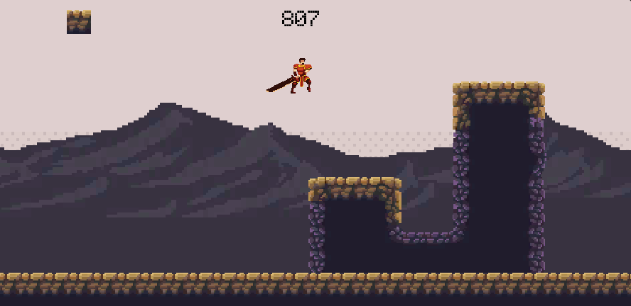

# Elements Runner: Master 3 elemental heroes and conquer obstacles in this epic side-scroller!

## Description
Prepare for an exhilarating journey through a vibrant world filled with danger and excitement in this captivating side-scrolling game. Take control of three heroic characters, each representing a different elemental power - water, fire, and air.

As you navigate through perilous landscapes, be prepared to encounter challenging obstacles that threaten to halt your progress. In a unique twist, whenever you collide with an obstacle, you'll be propelled backward, pushing you towards the left side of the screen. Stay focused and avoid hitting the left boundary, or your journey will come to an abrupt end!

The fire character possesses the ability to jump, allowing you to defy gravity and overcome obstacles with well-timed leaps. Master the art of precision jumping to advance through the hazardous terrain unscathed.

The water character gracefully glides through the air, providing you with the means to traverse wide gaps effortlessly. Take to the skies and harness the power of gliding to overcome daunting obstacles and reach new heights.

The air character excels in speed and agility, dashing through obstacles with lightning-fast reflexes. Utilize the character's dash ability to swiftly maneuver through challenging barriers and maintain your forward momentum.

Immerse yourself in a visually stunning world where skill, quick reflexes, and strategic thinking are essential. 

Are you ready to conquer each obstacle, harness the elemental heroes' unique powers, and triumph in this fast-paced side-scroller? Embark on an epic journey like no other and show the world your unstoppable determination!

## Assets and Resources 
### Map
* [Map](https://oisougabo.itch.io/free-platformer-16x16)

### Player
* [Fire Character](https://chierit.itch.io/elementals-fire-knight)
* [Water Character](https://chierit.itch.io/elementals-water-priestess)
* [Wind Character](https://chierit.itch.io/elementals-wind-hashashin)

### Music
* [Music](https://pixabay.com/music/synthwave-a-hero-of-the-80s-126684/)

### Interface
* [Buttons](https://free-game-assets.itch.io/free-jungle-cartoon-gui)